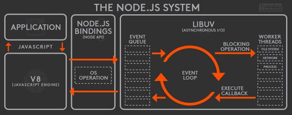
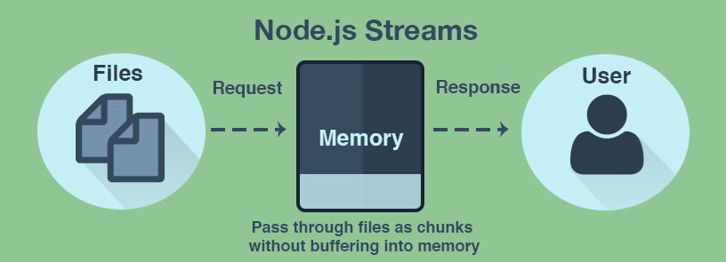
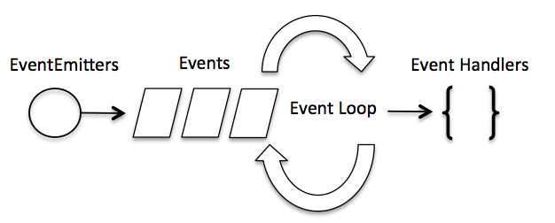
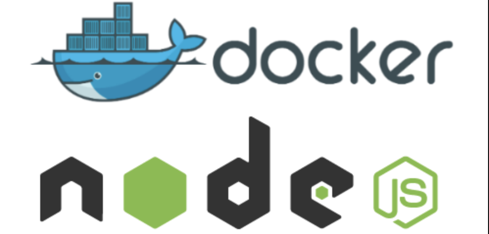

# Node

Nếu bạn là một lập trình viên hoặc một người mới bắt đầu thì để có thể bắt đầu học Node.JS một cách hiệu quả, cái đầu tiên bạn cần tìm hiểu đó chính là lộ trình học NodeJs. Học NodeJs bắt đầu từ đâu cũng là câu hỏi bạn sẽ phải tìm kiếm khi học NodeJS.

Bất cứ khi nào chúng ta bắt đầu học, mày mò, một loại công nghệ nào đó, thì câu hỏi đầu tiên được đặt ra và xuất hiện trong đầu là, chúng ta nên bắt đầu học từ đâu thì chính xác, con đường nào sẽ dẫn chúng ta tới vạch đích? Bây giờ nếu bạn chưa quen với Node.js và có ý định tìm hiểu nó thì bạn đã tìm đúng chỗ rồi đấy. Thông qua bài viết này, tôi sẽ vạch ra một lộ trình học dành cho bạn để tham khảo, điều này sẽ giúp bạn tìm hiểu Node.js cùng với một danh sách toàn diện các tài nguyên tốt nhất của nó giúp cho bạn bắt đầu học và sử dụng Node.js một cách dễ dàng và hiệu quả nhất.
Dưới đây là tổng quan về lộ trình tôi sẽ trình bày trong bài viết tìm hiểu Node.js này:

## Giới thiệu về Node.js

1. Kiến trúc Node.js
2. Cài đặt Node.js
3. NPM (Trình quản lý gói Node)
4. Tệp JSON
5. Khái niệm cơ bản về Node.js
6. Hệ thống tập tin
7. Sự kiện
8. Mô-đun HTTP
9. Framework
10. Cơ sở dữ liệu
11. js với Docker

Vậy chúng ta hãy bắt đầu.

Giới thiệu về Node.js và lộ trình học NodeJS:
Node.js là một framework mạnh mẽ được phát triển trên engine JavaScript V8 của Chrome, một trong những engine JavaScript nhanh nhất hiện có trên thị trường. Nó biên dịch JavaScript trực tiếp vào code của máy, điều này dẫn đến hiệu quả cao hơn của các ứng dụng được xây dựng bằng Node.js. Nó là một framework nhẹ và được sử dụng nhiều để phát triển các ứng dụng web ở phía máy chủ. Nó mở rộng API JavaScript để cung cấp các chức năng thông thường phía máy chủ.
Do thông lượng tốt hơn và tính nhất quán cao hơn, nó được sử dụng để phát triển ứng dụng quy mô lớn như các trang web streaming video, ứng dụng một trang và các ứng dụng web khác. Node.js sử dụng mô hình event-driven và non-blocking I/O, điều này làm cho nó trở thành một lựa chọn đúng đắn cho các ứng dụng thời gian thực sử dụng nhiều dữ liệu.
Bây giờ chúng ta hãy tìm hiểu lịch sử Node.js.

## Lịch sử và Các đợt phát hành

Lịch sử và Phát hành
Node.js ban đầu được phát hành vào năm 2009 bởi Ryan Dahl. Trong khoảng thời gian ngắn 10 năm, Node.js đã được sử dụng rộng rãi trong thế giới phát triển ứng dụng web. Trước Node.js, JavaScript đã từng thống trị thị trường này và đang phát triển tốt. Nhưng, điều gì đã tạo nên sự cần thiết của Node.js?
Như nhiều bạn đã biết thì JavaScript rất hữu ích khi nói về client-side scripting nhưng nó đã thất bại thảm hại khi phát triển các trang động bằng cách sử dụng JavaScript phía máy chủ. Đây là nơi Node.js phô trương các tính năng sáng tạo của nó giúp lập trình bằng JavaScript trên máy chủ.
Bây giờ bạn đã quen thuộc và hiểu được phần nào về nguồn gốc của  Node.js, chúng ta hãy đi xa hơn và xem tất cả những gì bạn cần biết trước khi bạn tìm hiểu Node.js.
Bắt đầu với Node.js: Tìm hiểu Node.js

## Bắt đầu

Để tìm hiểu Node.js, bạn phải thực hiện bước đầu tiên theo đúng hướng. Dưới đây tôi đã liệt kê các chủ đề theo thứ tự cùng với các nguồn mà bạn có thể tham khảo để làm chủ từng chủ đề.

1. Kiến trúc Node.js



Node.js sử dụng Kiến trúc mô hình vòng lặp sự kiện đơn luồng, có nghĩa là tất cả các yêu cầu của máy khách trên Node.js được thực hiện bởi một luồng. Nhưng kiến trúc này không chỉ là một luồng đơn, mà còn theo hướng sự kiện, điều này cuối cùng sẽ giúp Node.js xử lý đồng thời nhiều máy khách.

2. Cài đặt Node.js

Cài đặt Node.js là bước tiếp theo trong con đường tìm hiểu Node.js. Đây là một trong những quy trình đơn giản nhất và tất cả những gì bạn cần làm là truy cập Trang web chính thức của Node.js và tải xuống phiên bản ổn định. Nhưng trước khi cài đặt, bạn cần đảm bảo rằng bạn có đủ dung lượng ổ cứng và RAM ít nhất là 4GB.

3. NPM (Trình quản lý gói Node)

Khi bạn đã hoàn tất phần cài đặt, bước tiếp theo là tìm hiểu về npm. NPM hay Trình quản lý gói Node hoạt động như cốt lõi của ứng dụng Node.js. Nó cung cấp khoảng hơn 800.000 thư viện dựng sẵn như các công cụ tuyệt vời cho các lập trình viên Node.js và tăng tốc quá trình phát triển ứng dụng hoàn chỉnh.

4. Tệp JSON

Tệp JSON được coi là trái tim của ứng dụng Nodejs. Đây là tệp đầu tiên mà bạn cần tạo trong khi làm việc với dự án Nodejs. Nó là tệp kê khai chứa metadata của dự án. Nói cách khác, tệp package.json của dự án được sử dụng để quản lý các dependency được sử dụng trong dự án cùng với các tập lệnh, được yêu cầu để tạo các bản dựng, chạy test, v.v.

5. Khái niệm cơ bản về Nodejs


Đây là bước bắt đầu với Nodejs. Để thực hiện một ‘Hello World’ đơn giản trong Nodejs, bạn cần có hiểu biết cơ bản về các khái niệm như biến, kiểu dữ liệu, toán tử, hàm, v.v. trong JavaScript vì Nodejs là framework JavaScript.

1. Hệ thống tập tin

Vào thời điểm bạn hoàn thành các bước cơ bản của lộ trình học Nodejs, bạn sẽ hoàn thành việc tạo và thực hiện các chương trình cơ bản trong lộ trình học Nodejs. Bây giờ, bước tiếp theo của bạn sẽ là đọc và ghi dữ liệu vào một tệp chứ không phải trên console. Để truy cập hệ thống tệp vật lý, Nodejs sử dụng mô đun fs.

7. Sự kiện


Nodejs phổ biến nhất cho các ứng dụng hướng sự kiện. Nodejs cung cấp một mô-đun sự kiện mà bạn cần sử dụng để tạo và xử lý các sự kiện tùy chỉnh. Vì ứng dụng Nodejs dựa trên kiến trúc đơn luồng và theo sự kiện, nên nó hỗ trợ concurrency.

1. Mô-đun HTTP

Một chức năng khác, mà Nodejs được sử dụng nhiều trong ngành là để phát triển các ứng dụng dựa trên máy chủ. Sử dụng mô-đun http, bạn có thể dễ dàng xây dựng API REST bằng Nodejs.

9. Framework

Viết code cho từng chức năng từ đầu mỗi lần bạn tạo ứng dụng Nodejs rất tốn thời gian. Do đó, Nodejs cung cấp, một số framework giúp bạn phát triển ứng dụng nhanh hơn với các tính năng tốt hơn. Dưới đây là một số framework Nodejs được sử dụng nhiều nhất:

* Express.js
* AdonisJs
* Meteor.js
* NestJs
* Sails

10. Cơ sở dữ liệu

Đến bây giờ, bạn đã biết cách phát triển một ứng dụng web đầy đủ chức năng với Nodejs. Bây giờ bạn cần trang bị cho ứng dụng của mình bằng cách lưu trữ trong cơ sở dữ liệu. Bạn có thể sử dụng bất kỳ cơ sở dữ liệu nào theo sở thích và nhu cầu của bạn. Có thể kể tên một vài:

* MySQL
* MongoDB
* Cassandra
* Oracle
* CouchDB
 

11. Node với Docker

  

Bạn sẽ cần Docker nếu bạn muốn làm cho ứng dụng của bạn không có bất kỳ phụ thuộc môi trường nào. Trong cộng đồng IT, Docker là một nền tảng container hóa được sử dụng để đóng gói một ứng dụng và các phụ thuộc của nó với nhau trong một container Docker. Điều này đảm bảo cho việc hoạt động dễ dàng và trơn tru của ứng dụng bất kể những thay đổi nào trong môi trường. Do đó, bạn có thể nghĩ Docker là một công cụ được thiết kế để giúp cho việc tạo, triển khai và thực thi các ứng dụng bằng cách sử dụng các container dễ dàng và hiệu quả hơn.
Với điều này, chúng tôi đi đến cuối của bài viết. Tôi hy vọng đã có thể bao quát tất cả các điểm quan trọng trong lộ trình học Nodejs. Chúc các bạn may mắn.
Đồng thời nếu bạn đang muốn tìm một trung tâm đào tạo uy tín có thể đảm bảo kiến thức cho bạn thì hãy nhanh tay đăng ký ngay tại Nordic Coder – Trung tâm đào tạo lập trình hàng đầu Việt Nam. Nordic Coder có lộ trình học NodeJS cơ bản giúp cho bạn có được kiến thức vững chắc về NodeJS sau khi hoàn thành khoá học.
